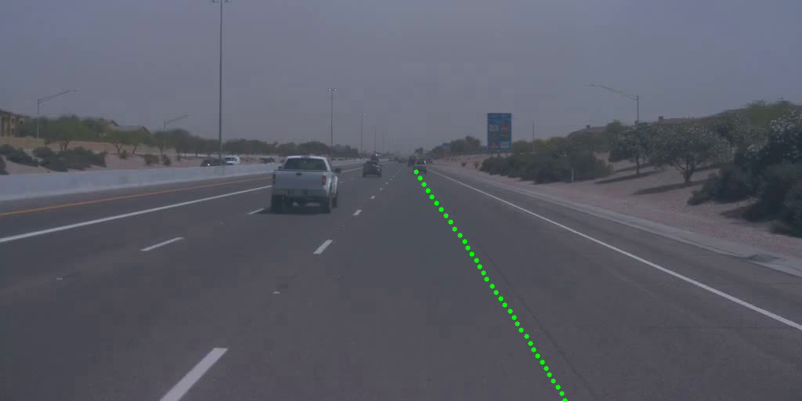

## AutoSteer
AutoSteer is a neural network which aims to predict the steering angle of a vehicle in order to follow the overall shape of the road the vehicle is travelling along. This is a type of road-curvature estimation, and can be used to help autonomous vehicles navigate highly curved roads and roads with high bank angles, where traditional road curvature estimation methods fail.

AutoSteer takes as input the lane mask output from the EgoLanes network for the current and previous image. It outputs a probability vector which encodes fixed steering angles, and the argmax of this probability vector informs us of the steering angle predicted by the model. In practice, we add a moving average filter to the model output to ensure that the predicted steering values are smooth over time.

## Watch the explainer video
Please click the video link to play - [***Video link***](https://drive.google.com/file/d/1hYJss-xWskAktQg0qU722b8YyQSokq_d/view?usp=drive_link)

## AutoSteer model weights
### [Link to Download Pytorch Model Weights *.pth](https://drive.google.com/file/d/17yu0H81sFE6ZHuviT7SXH3iMjMmyyS0t/view?usp=sharing)
### [Link to Download ONNX FP32 Weights *.onnx](https://drive.google.com/file/d/1gxH6EM4HJ0rfnqt90cT1w7hgizW49jQe/view?usp=sharing)

## AutoSteer 2.0 - ego-path line prediction

Accurate estimation of the steering angle is essential for autonomous driving and cruise control applications, as it ensures reliable tracking of the road geometry. Road curvature is directly related to the steering angle, and accurate curvature estimation plays a critical role in vehicle control. The proposed AutoSpeed DNN enhances performance in challenging scenarios, such as highly curved roads and roads with significant bank angles, where traditional curvature estimation methods often fail.

The AutoSteer 2.0 architecture builds upon components of the YOLO11 framework, incorporating a specially designed head, and predicts the ego-path line directly from the input image. This ego-path representation captures the underlying road geometry and curvature, enabling more robust and accurate steering estimation.

### Demo Video

## Get Started
To easily try out the model on your own images and videos, please follow the steps in the [tutorial](tutorial.ipynb). For the best results, please ensure that your input video matches the aspect ratio of the model.

### Performance Results

AutoSteer 2.0 network is trained on combined dataset from three distinct datasets [TUSimple](https://www.kaggle.com/datasets/manideep1108/tusimple), [OpenLane](https://github.com/OpenDriveLab/OpenLane) and [CurveLanes](https://github.com/SoulmateB/CurveLanes). Dataset is prepared with 90:10 ratio for train:val split, and we achieve a mAP@50 score of 0.9691 and a mAP score of 0.9546 on validation data.

## Model variants

AutoSteer takes as input the lane mask output from the EgoLanes network for the current and previous image. It outputs a probability vector which encodes fixed steering angles, and the argmax of this probability vector informs us of the steering angle predicted by the model. In practice, we add a moving average filter to the model output to ensure that the predicted steering values are smooth over time.

AutoSteer 2.0 processess camera frames in a 2:1 aspect ratio with size 1024px by 512px and predicts ego-path line in camera coordinate system.

AutoSteer 2.0 model weights - 2:1 aspect ratio, 1024px by 512px input image

### [Link to Download Pytorch Model Weights *.pth]()
### [Link to Download ONNX FP32 Weights *.onnx]()

AutoSteer model weights 

### [Link to Download Pytorch Model Weights *.pth](https://drive.google.com/file/d/17yu0H81sFE6ZHuviT7SXH3iMjMmyyS0t/view?usp=sharing)
### [Link to Download ONNX FP32 Weights *.onnx](https://drive.google.com/file/d/1gxH6EM4HJ0rfnqt90cT1w7hgizW49jQe/view?usp=sharing)